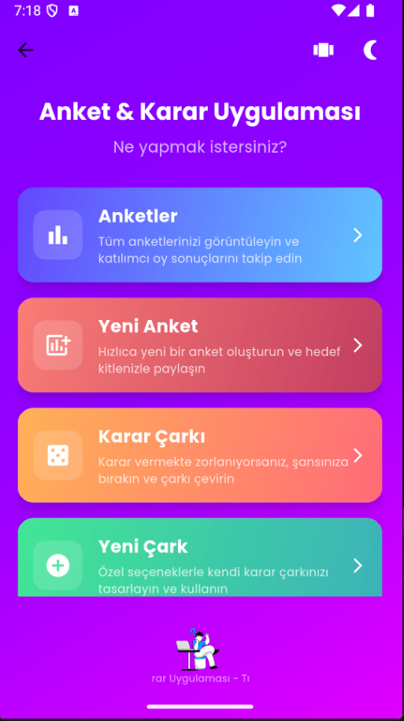
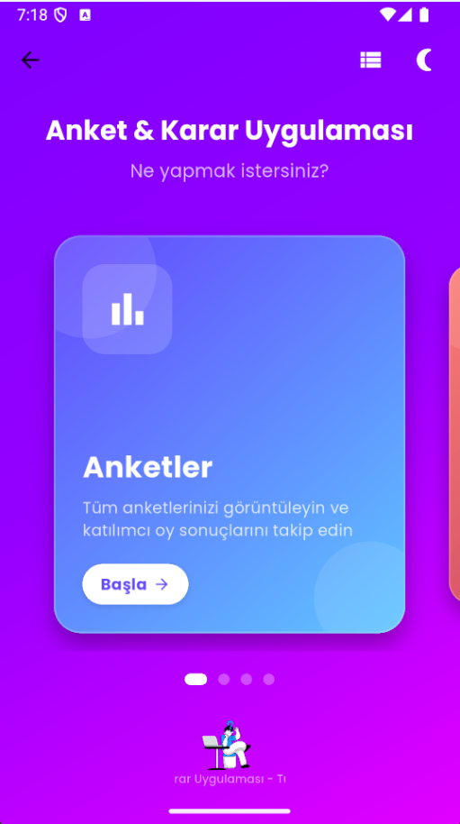
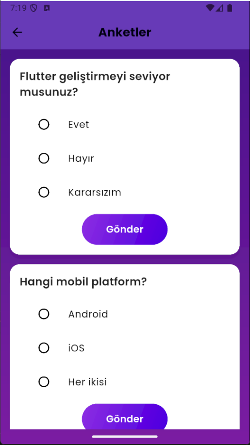

# Anket & Karar Uygulaması


Modern ve görsel olarak etkileyici bir Flutter uygulaması: Anket oluşturma, karar çarkları ve kullanıcı dostu bir arayüz ile karar verme süreçlerinizi kolaylaştırın. Kendine has kart tasarımı ve animasyonlu arayüzüyle dikkat çeken bu uygulama karar verme süreçlerine birebirdir.

## ✨ Özellikler

### 📊 Anket Özellikleri
- Anket oluşturma ve istediğiniz soruları/seçenekleri ekleme
- Anketlere katılma ve sonuçları görüntüleme
- Gerçek zamanlı sonuç takibi ve görselleştirme

### 🎡 Karar Çarkı
- Tamamen özelleştirilebilir karar çarkları
- Renkli ve görsel olarak etkileyici tasarım
- Sürükleyici animasyonlar ve sonuç kutlaması

### 🎨 Tasarım ve Kullanıcı Deneyimi
- **Kart arayüzü** - Sürüklenebilir büyük kartlar
- **İki farklı görünüm** - Kart veya liste görünümü arasında geçiş yapabilme
- **Tema desteği** - Açık/koyu tema ve otomatik tema kaydı
- **Etkileyici animasyonlar** - Lottie animasyonları ve özel geçiş efektleri
- **Modern bildirimler** - Özelleştirilmiş snackbar ve diyalog kutuları
- **Glass-morphism** - Modern cam efektli UI bileşenleri

### 🔧 Teknik Özellikler
- BLoC pattern ile gelişmiş state yönetimi
- Clean Architecture prensipleri (data, domain, presentation katmanları)
- Dependency Injection (get_it) ile modüler yapı
- SharedPreferences ile yerel veri saklama
- Offline font desteği (Poppins)
- Responsive tasarım - farklı ekran boyutlarına uyum

## 📱 Ekran Görüntüleri


Uygulamanın farklı ekranlarından görüntüler:

- Açılış Ekranı ve Ana Sayfa (Kart Görünümü)



- Ana Sayfa (Liste Görünümü) ve Tema Değiştirme
- Karar Çarkı ve Sonuç Ekranı

- Anket Oluşturma ve Katılım Ekranları



## 🚀 Kurulum ve Çalıştırma

1. Projeyi klonlayın:
   ```bash
   git clone <https://github.com/ismailhakkii/anket.git>
   cd anket
   ```

2. Bağımlılıkları yükleyin:
   ```bash
   flutter pub get
   ```

3. Uygulamayı çalıştırın:
   ```bash
   flutter run
   ```

## 🏗️ Proje Yapısı

```
lib/
  ├─ main.dart                  # Uygulama giriş noktası ve tema yönetimi
  ├─ injection_container.dart   # Dependency injection yapılandırması
  ├─ features/                  # Ana özellik modülleri
  │   ├─ survey/               # Anket modülü
  │   │   ├─ data/            # Veri katmanı
  │   │   ├─ domain/          # İş mantığı katmanı
  │   │   └─ presentation/    # UI katmanı (bloc, pages, widgets)
  │   └─ decision/            # Karar çarkı modülü
  │       ├─ data/            # Veri katmanı
  │       ├─ domain/          # İş mantığı katmanı
  │       └─ presentation/    # UI katmanı (bloc, pages, widgets)
  └─ presentation/             # Genel UI bileşenleri
      ├─ pages/               # Ana sayfalar (home_page, splash_screen)
      └─ theme/               # Tema tanımları ve UI yardımcıları
```

## 🎨 UI Bileşenleri ve Özellikler

### Özel Tema Sistemi
Uygulamada tamamen özelleştirilmiş bir tema sistemi bulunmaktadır. `AppTheme` sınıfı aracılığıyla açık ve koyu tema arasında geçiş yapabilir, kullanıcı tercihi otomatik olarak kaydedilir.

### Özel Bildirimler ve Diyaloglar
- `CustomSnackBar`: Farklı türlerde (başarılı, hata, bilgi, uyarı) bildirimler
- `CustomDialog`: Özelleştirilmiş diyalog kutuları
- `LoadingOverlay`: Yükleme göstergesi

### Animasyonlar
- Sayfa geçişleri için `CustomPageTransition`
- Ana sayfada kart animasyonları ve 3D dönüş efektleri
- Açılış ekranında sıralı animasyonlar
- Karar çarkında konfeti ve sonuç kutlaması

### Görünüm Değiştirme
Ana sayfada iki farklı görünüm (kart/liste) arasında geçiş yapabilme özelliği.

## 📝 Notlar ve Sorun Giderme

- Eğer font yükleme sorunları yaşıyorsanız:
  - `GoogleFonts.config.allowRuntimeFetching = false` ayarının yapılmış olduğundan emin olun
  - Tüm font dosyalarının `assets/fonts/` dizininde bulunduğunu kontrol edin

- Performans optimizasyonu için ipuçları:
  - Animasyonlar cihazınızda yavaş çalışıyorsa, `main.dart` dosyasındaki `timeDilation` değerini ayarlayabilirsiniz
  - Düşük donanımlı cihazlarda liste görünümünü tercih edin

## 📱 Platform Desteği

- ✅ Android
- ✅ iOS
- ✅ Web
- ✅ Windows
- ✅ macOS
- ✅ Linux

## 🤝 Katkıda Bulunma

Projeye katkıda bulunmak için pull request gönderebilir veya iyileştirmeler önerebilirsiniz. Hata raporları için issues oluşturabilirsiniz.

## ⭐ 

Eğer projeyi beğendiyseniz yıldızlamayı unutmayın. :)

